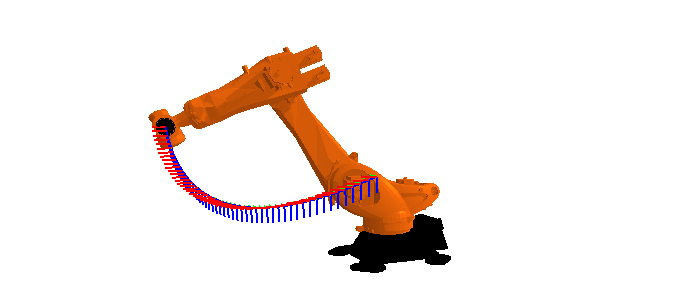

# Summary
The trend towards individualized products and the increasing demand for a greater number of variants require a rethinking in the production engineering environment. In the context of this transformation, we see robots taking on more and more manufacturing tasks [@wsk].
The development of this field is hampered by a toolchain gap: While there are a large number of robot simulations and process simulations there is not yet a simple simulation environment that combines the two and allows the user to investigate the interplay of both.

Pybullet_industrial extends the open source library Pybullet with several process models to simulate manufacturing applications that add material, remove material or simply move material. A sample of concrete manufacturing applications in each category can be seen in Figure \ref{manu_process}.

The package not only simulates the environmental effect of the processes but also the forces imparted on the robot. It also allows the dynamic switching of processes with the same robot corresponding to tool changes during the manufacturing process. The package also contains utility functions such as path builder classes which are based on G-code interpolation schemes or a variety of drawing and visualization functions.

# Statement of need
Pybullet_industrial was developed for the interdisciplinary field of robot manufacturing.
While there are a large number of simulation tools for robotics research such as Gazebo [@gazebo], CoppeliaSim [@coppeliasim], or webots[@webots], their capabilities all end at the robot endeffector as they are unable to simulate manufacturing processes.
In the same vein, there are several popular FE simulation tools such as Abaqus [@abaqus] capable of simulating process behavior.
These simulations end at the tool as they are not meant to simulate the systems that move the tool.
Since robots are now performing more and more manufacturing tasks studying and accounting for the interaction between robots and processes becomes ever more important.
This requires a simulation that can simulate robots and processes.

Pybullet_industrial closes this gap by taking classical multibody simulations that end at the endeffector and then deploying simple process simulations which impact the environment.
Pybullet_industrial is thus the first process-aware robot simulation platform build for research.
Note that Pybullet_industrial neither aims to develop perfect process simulations nor robot simulations, it focuses on the interplay of both.
Example applications of Pybullet_industrial are:

* Designing joint controllers that compensate for the large process forces during milling
* Design path planning algorithms for 3D printing that can detect if a robot combines with a previously printed object.
* Check the coating of an object in complex scenarios where the object is moved by a robot while another one is spraying paint.

# Overview

Robot simulations typically end at the endeffector while process simulations typically end where the tool is connected to the machine. Pybullet_industrial divides functionality similarly by employing a Robot class simulating the multibody dynamics of a Robot manipulator and an Endeffector Tool class capable of simulating processes.
A sample simulation view with both objects can be seen in Figure \ref{pybullet_industrial_overview}.

These objects can be deployed into a standard pybullet simulation environment and used to build manufacturing scenarios.

## Robot objects

The RobotBase class builds upon pybullets URDF (Universal Robot Description Format) import feature which allows the loading of dynamic multibody robot models. The class adds several convenient interfaces which allow the setting and measuring of joint and endeffector states. This latter allows the user to reposition the endeffector without worrying about the underlying kinematics.

## Endeffector Tools

Endeffector Tools are the main novelty of this library and implement various process models.
An EndeffectorTool object can be coupled with a robot attaching it at the flange of the endeffector.
The tool provides a positioning interface that automatically calls the endeffector interface of a coupled robot making it easy to reposition the tool center point in space.

Note that coupling and decoupling of tools can be done during runtime to simulate tool quick changes common in complex manufacturing cells.

While the base object implements the main interfaces and structure of the class, different process models are implemented as children of the EndeffectorTool object. These process models can be grouped into three different categories as seen in Figure \ref{manu_process}.

The adding of material is done using an extruder which uses raycasts to spawn objects either on the surface of another object or at the end of the raycast.
These objects are implemented as Materials that can have different properties from massless particles sticking to surfaces (such as paint) to physical bodies like 3D printing plastic.
By default, no force is imparted during such processes although custom force models can be added by implementing the calculate_process_force function.

Removing of material is either done using the MillingTool which uses the Kienzle force model [@kienzle] for planar milling or the Remover which is the twin of the remover and can be used to simulate processes such as sandblasting or waterjet cutting.
The process force model for milling can be seen in Figure \ref{kienzle_force}. Here the chip thickness exponent and the material-specific force are material-dependent.

![Cutting Force calculation as described by the Kienzle Model [@kienzle] \label{kienzle_force}](cutting_force.png)

The moving of material is achieved using grippers. Pybullet_industrial supports both finger grippers and suction grippers for this purpose.

For camera-based applications, the library also contains a camera sensor tool that can be used to simulate process inspection tasks.

## Utility
To make development easier, the library has several utility functions.
This includes the ToolPath class which has a custom iterator making it easy for tools and robots to follow predetermined paths. These paths can be built using different interpolation functions such as linear interpolation, spline interpolation, or circular interpolation.
Path positions and orientations can be visualized using drawing functions as seen in Figure \ref{robot_path}.
These underlying functions can also be used to visualize arbitrary coordinate systems or robot link poses.

# References
